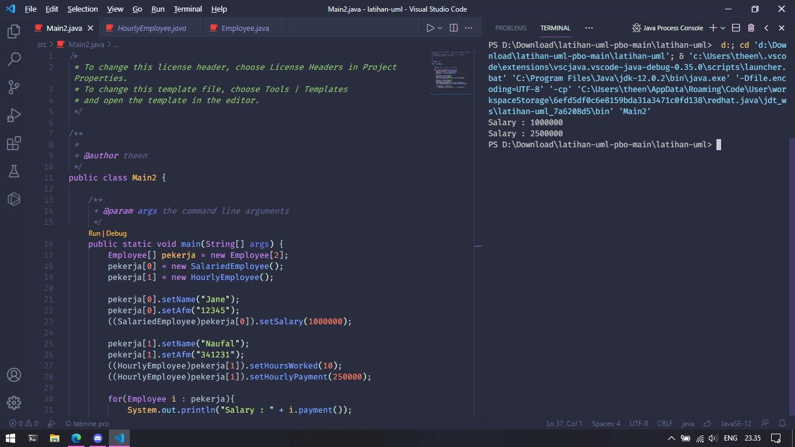

# Latihan UML PBO
## Anggota Kelompok:
   1. Naufal Anbial Falah (2017051072)
   2. Fachri Azka Nur (2017051054)
   3. // jgn lupa diisi

Pada hasil running menampilkan salary dari object SalariedEmployee kemudian HourlyEmployee.

